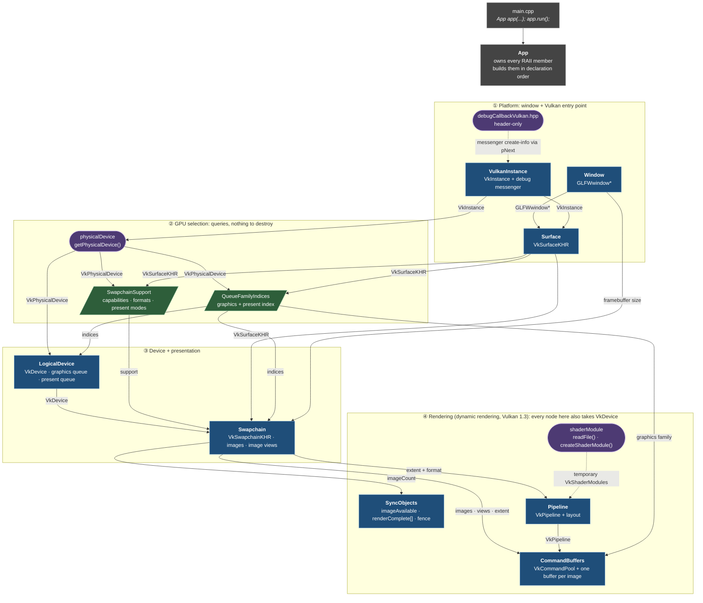
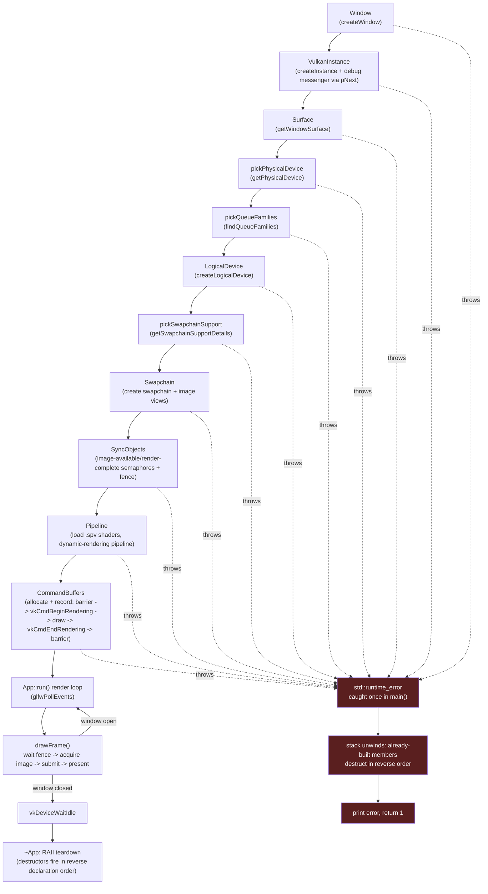

# Tannery — Architecture Brain Map

A visual snapshot of everything built so far, current as of the
triangle-render milestone: dynamic rendering (Vulkan 1.3, no
`VkRenderPass`/`VkFramebuffer`), sync objects wired into the render loop, and
construction/teardown driven by RAII class lifetimes rather than manual step
codes. Two views: a **structural diagram** (module relationships, grouped into
layers) and a **build-order flow diagram**
(the actual sequence `App`'s constructor and `run()` execute).

This file is a living snapshot, not auto-generated — re-sync it by hand whenever
a new module/file pair is added.

---

## 1. Structural diagram (module relationships)

Modules are grouped into four layers, one row per layer, read top to bottom.
Each arrow goes **from the provider to the consumer** and is labeled with the
handle or data that moves along it. It is drawn only where a constructor or
function actually takes that value as a parameter. Node shape and color show
what *kind* of module it is (see the key under the diagram).

**Key**

| Shape / color | Kind | Examples |
|---|---|---|
| blue rectangle | **RAII class**: owns a Vulkan/GLFW handle, destroys it in `~T()`, copy and move are deleted | `Window`, `LogicalDevice`, `Pipeline` |
| purple pill | **free functions / helpers**: no owned lifetime | `getPhysicalDevice`, `createShaderModule` |
| green parallelogram | **plain data struct** returned by a query and stored by value in `App` | `QueueFamilyIndices`, `SwapchainSupport` |
| `-->` solid arrow | "is passed this as a constructor/function argument" | |
| `-.->` dashed arrow | helper used internally, nothing is stored | |

**Who owns what** (the same order as `App`'s member declarations, which is
also the build order; teardown runs bottom to top):

| # | `App` member | Type | Owns / destroys | Built from |
|---|---|---|---|---|
| 1 | `window` | `Window` | `GLFWwindow*` (+ `glfwTerminate`) | width, height, title |
| 2 | `instance` | `VulkanInstance` | `VkInstance`, `VkDebugUtilsMessengerEXT` | title |
| 3 | `surface` | `Surface` | `VkSurfaceKHR` | instance, window |
| 4 | `physicalDevice` | `VkPhysicalDevice` | nothing (the GPU is not destroyed) | instance |
| 5 | `indices` | `QueueFamilyIndices` | nothing (value) | physicalDevice, surface |
| 6 | `device` | `LogicalDevice` | `VkDevice` (queues come with it) | physicalDevice, indices |
| 7 | `support` | `SwapchainSupport` | nothing (value) | physicalDevice, surface |
| 8 | `swapchain` | `Swapchain` | `VkSwapchainKHR`, `VkImageView`s | device, surface, support, window, indices |
| 9 | `syncObjects` | `SyncObjects` | semaphores + fence | device, swapchain image count |
| 10 | `pipeline` | `Pipeline` | `VkPipeline`, `VkPipelineLayout` | device, extent, `.spv` paths, format |
| 11 | `commandBuffers` | `CommandBuffers` | `VkCommandPool` (its buffers are freed with it) | device, images, views, pipeline, extent, indices |

**Reading it:** everything traces back to `VulkanInstance` in layer ①. No
other module can exist without a `VkInstance`. Two hubs feed everything
below them. `Surface` and the selected `VkPhysicalDevice` together decide
queue families and swapchain support, because those are properties of that
specific GPU-plus-window pairing and not of either one alone. `LogicalDevice`
then feeds a `VkDevice` to every object in layer ④ (left off the diagram
as arrows to keep it readable), and `Swapchain` supplies the
per-image data (extent, format, images, count). There is no `VkRenderPass` or
`VkFramebuffer` anywhere. `CommandBuffers` records
`vkCmdBeginRendering` directly against the swapchain image views, and that is
why it takes `images` + `imageViews` rather than framebuffers.

---

## 2. Build-order flow (what `App` actually runs)

The structural diagram shows *relationships*; this shows *execution order* —
the literal top-to-bottom sequence `App`'s member-initializer list runs
through in `App::App` (`core/src/App.cpp`), followed by the `run()` loop.
`main.cpp` itself is now just `App app(...); app.run();` inside a
`try`/`catch`.

There are no more numbered `return N` failure codes or a manual `cleanup()`
call — every member is an RAII class (or a `static` helper that throws), so a
failure anywhere unwinds the stack, destructs whatever was already built (in
reverse order, for free, via normal C++ semantics), and lands in the single
`catch` block in `main.cpp`.

**Reading it:** every step is still a strict prerequisite for the next — this
is a linear pipeline, not a tree — but the failure handling inverted: instead
of each step explicitly calling `cleanup()` with `VK_NULL_HANDLE` placeholders
for anything not yet created, each module's constructor is responsible only
for its own resource, and the compiler-generated stack unwinding guarantees
reverse-order teardown of everything that *did* get constructed. `App`'s
member declaration order in `App.hpp` (window, instance, surface,
physicalDevice, indices, device, support, swapchain, syncObjects, pipeline,
commandBuffers) *is* the build order, and `~App`'s implicit destructor runs
it in reverse — the same guarantee `cleanup.hpp` used to provide by hand.

---

## Legend

| Symbol | Meaning |
|---|---|
| blue / purple / green nodes | RAII class / free-function helper / plain data struct (full key under section 1) |
| red flowchart node | the shared exception path — any construction step can `throw std::runtime_error`, caught once in `main()`, unwinding already-built RAII members in reverse |
| dashed arrow (`-.->`) | "may throw into" — every build step can fail into the single exception path |
